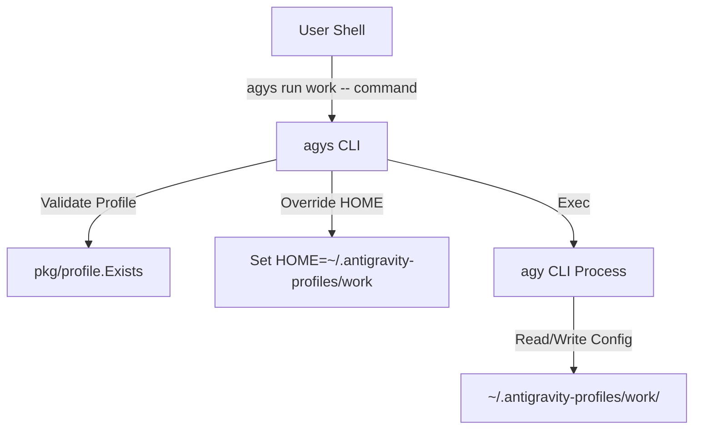

# Antigravity CLI Switcher (`agys`)

`agys` (Antigravity CLI Switcher) is an open-source CLI utility built in Go that isolates account profiles for the `agy` CLI tool. It dynamically overrides the `HOME` environment variable for `agy` execution to profile-specific base directories under `~/.antigravity-profiles/<profile_name>/`.

> [!NOTE]
> Profile directories are kept fully isolated from your global home directory, ensuring separate auth tokens, configs, and application states for each profile.

---

## Features

- **Profile Isolation**: Each profile gets its own home directory (`~/.antigravity-profiles/<profile_name>/`).
- **Interactive Terminal Support**: Preserves `os.Stdin`, `os.Stdout`, and `os.Stderr` streaming so interactive logins and typing token responses work seamlessly.
- **Cross-Platform**: Binary packages available for macOS and Linux across `amd64` and `arm64` architectures.
- **Zero-Dependency One-Liner Install**: Easy installation via POSIX shell script.

---

## Installation

### One-Liner Shell Installer

Install the latest release automatically:

```bash
curl -fsSL https://raw.githubusercontent.com/quaywin/agys/main/install.sh | bash
```

The script detects your OS and CPU architecture, fetches the latest GitHub release, and installs `agys` to `$HOME/.local/bin` or `/usr/local/bin`.

### From Source

If you have Go 1.22+ installed:

```bash
git clone https://github.com/quaywin/agys.git
cd agys
go build -o agys main.go
mv agys ~/.local/bin/
```

---

## Quick Start

### 1. Add & Authenticate a Profile
Create a new profile folder and trigger `agy login` under the isolated environment:

```bash
agys add work
```

### 2. List Profiles
Display all active configured profiles:

```bash
agys list
# or
agys ls
```

### 3. Run Commands Under a Profile
Execute any `agy` command isolated to a specific profile:

```bash
agys run work -- status
```

### 4. Delete a Profile
Remove a profile directory:

```bash
agys delete work
# or skip confirmation prompt:
agys delete work --force
```

---

## CLI Usage Reference

```text
agys isolates account profiles by dynamically overriding the HOME environment
variable for the agy command to profile-specific base directories (~/.antigravity-profiles/<profile_name>/).

Usage:
  agys [command]

Available Commands:
  add         Create a new profile and perform agy login
  delete      Delete a profile directory (alias: rm)
  list        List all active profile directories (alias: ls)
  run         Execute agy command with specified profile

Flags:
  -h, --help   help for agys
```

---

## Architecture


