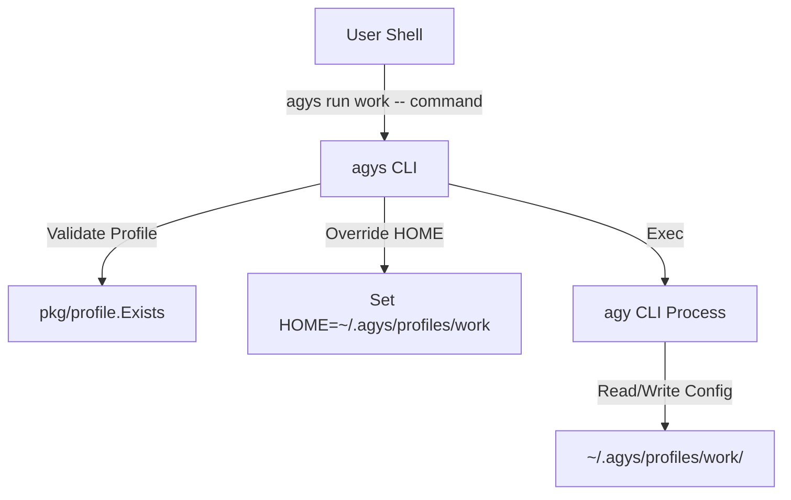

# Antigravity CLI Switcher (`agys`)

`agys` (Antigravity CLI Switcher) is an open-source CLI utility built in Go that isolates account profiles for the `agy` CLI tool. It dynamically overrides the `HOME` environment variable for `agy` execution to profile-specific base directories under `~/.agys/profiles/<profile_name>/`.

> [!NOTE]
> Profile directories are kept fully isolated from your global home directory, ensuring separate auth tokens, configs, and application states for each profile.

---

## Features

- **Profile Isolation**: Each profile gets its own home directory (`~/.agys/profiles/<profile_name>/`).
- **Interactive Terminal Support**: Preserves `os.Stdin`, `os.Stdout`, and `os.Stderr` streaming so interactive logins and typing token responses work seamlessly.
- **Default Active Profile**: Set a default profile (`agys use work`) to run commands (`agys run -- status`) without re-typing profile names.
- **Model Quota Tracking**: Real-time quota status and refresh windows across profiles in parallel (with optional JSON output).
- **Shell Auto-Completion & Aliases**: Built-in completion generator for `bash`, `zsh`, `fish`, `powershell` with tab-completion for profile names, plus shell alias generation (`agys alias`).
- **Cross-Platform**: Binary packages available for macOS and Linux across `amd64` and `arm64` architectures.
- **Zero-Dependency One-Liner Install**: Easy installation via POSIX shell script.

---

## Installation

### One-Liner Shell Installer

Install the latest release automatically:

```bash
curl -fsSL https://raw.githubusercontent.com/quaywin/agys/main/install.sh | bash
```

The script detects your OS and CPU architecture, fetches the latest GitHub release, and installs `agys` to `$HOME/.local/bin` or `/usr/local/bin`.

### From Source

If you have Go 1.22+ installed:

```bash
git clone https://github.com/quaywin/agys.git
cd agys
go build -o agys main.go
mv agys ~/.local/bin/
```

---

## Quick Start

### 1. Add & Authenticate a Profile
Create a new profile folder and trigger `agy login` under the isolated environment:

```bash
agys add work
```

### 2. List Profiles
Display all active configured profiles:

```bash
agys list
# or
agys ls
```

### 3. Set a Default Profile
Set an active default profile so you can omit the profile argument when executing commands:

```bash
# Set default profile
agys use work

# View current default profile
agys use

# Clear default profile
agys use --unset
```

### 4. Run Commands Under a Profile
Execute any `agy` command isolated to a specific profile or your configured default:

```bash
# Run command with explicit profile name
agys run work -- status

# Run command using default profile
agys run -- status
```

### 5. Rename a Profile
Rename an existing profile directory:

```bash
agys rename work company
# or
agys mv work company
```

### 6. Delete a Profile
Remove a profile directory:

```bash
agys delete work
# or skip confirmation prompt:
agys delete work --force
```

### 7. Check Quota Status
Display the remaining model quota and refresh windows for one or all profiles:

```bash
# Check detailed quota for all profiles in parallel
agys quota
# or
agys q

# Check quota for a specific profile
agys quota work

# Output detailed quota in JSON format for automation
agys quota --json

# Show a compact quota summary directly when listing profiles
agys list -q
# or
agys ls --quota
```

### 8. Shell Aliases & Auto-Completion

```bash
# Generate shell aliases for your profiles (e.g. alias agy-work="agys run work --")
eval "$(agys alias)"

# Enable tab-completion in Zsh / Bash / Fish
source <(agys completion zsh)
# or for bash:
source <(agys completion bash)
```

### 9. Version & Upgrading

```bash
# Check installed version
agys version
# or
agys --version

# Upgrade to the latest release automatically
agys upgrade
# or
agys update

# Check if an update is available without installing
agys upgrade --check
```

---

## Directory & Configuration Layout

`agys` stores all data under `~/.agys/` by default (or the custom directory specified by the `AGYS_DIR` environment variable):

```text
~/.agys/
├── current                  # Active default profile setting (created by `agys use`)
└── profiles/                # Base directory storing isolated profiles
    ├── work/                # Isolated HOME directory for profile "work"
    └── personal/            # Isolated HOME directory for profile "personal"
```

To use a custom location for profiles:

```bash
export AGYS_DIR="/custom/path/to/.agys"
```

---

## CLI Usage Reference

```text
agys isolates account profiles by dynamically overriding the HOME environment
variable for the agy command to profile-specific base directories (~/.agys/profiles/<profile_name>/).

Usage:
  agys [command]

Available Commands:
  add         Create a new profile and perform agy login
  alias       Generate shell aliases for configured profiles
  completion  Generate shell completion scripts
  delete      Delete a profile directory (alias: rm)
  list        List all active profile directories (alias: ls)
  quota       Check model quota and usage for profile(s) (alias: q)
  rename      Rename an existing profile directory (alias: mv)
  run         Execute agy command with specified or default profile
  upgrade     Upgrade agys CLI to the latest version (alias: update)
  use         Set or display the default active profile
  version     Display version information for agys CLI

Flags:
  -h, --help      help for agys
  -v, --version   version for agys
```

---

## Architecture


