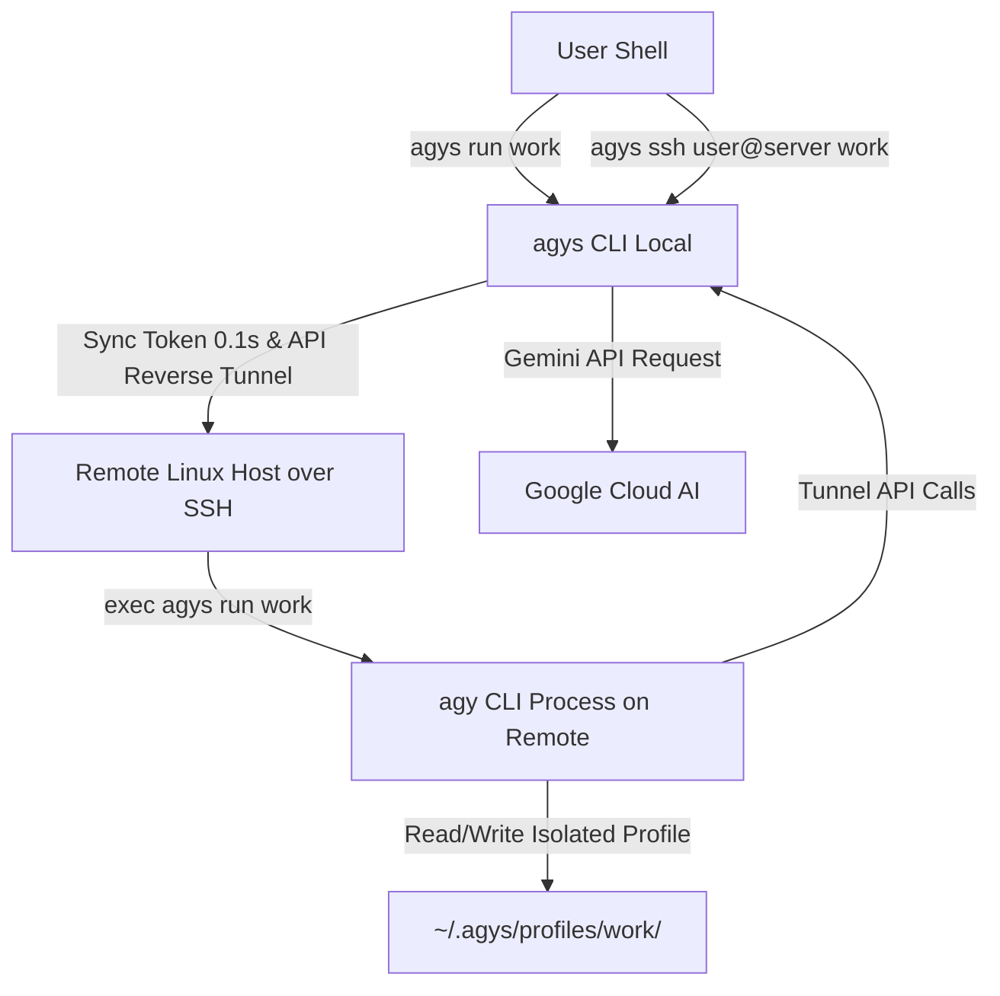

# Antigravity CLI Switcher (`agys`)

`agys` (Antigravity CLI Switcher) is an open-source CLI utility built in Go that isolates account profiles for the `agy` CLI tool. It dynamically overrides the `HOME` environment variable for `agy` execution to profile-specific base directories under `~/.agys/profiles/<profile_name>/`.

> [!NOTE]
> Profile directories are kept fully isolated from your global home directory, ensuring separate auth tokens, configs, and application states for each profile.

---

## Features

- **Profile Isolation & Token Protection**: Each profile gets an isolated home directory (`~/.agys/profiles/<profile_name>/`) with automatic macOS Keychain token clearing on profile switch to prevent cross-account auth bleed.
- **Google Account Email Display**: Automatically fetches and caches the associated Google Account Email (e.g. `user@gmail.com`) for each profile, displayed directly in `agys list` and `agys quota`.
- **Real-Time Model Quota Tracking**: Real-time 5-hour and weekly quota status across profiles in parallel (with optional JSON output), powered by the `daily-cloudcode-pa` endpoint.
- **Auto Profile Selection**: Dynamically selects the profile with the best 5-hour Gemini quota based on profile priorities (`agys auto` or `agys use auto`).
- **Profile Priority & Quota Threshold**: Configure custom profile priorities (`agys priority set work 10`) with smart 50% quota threshold fallback.
- **Interactive Terminal Support**: Preserves `os.Stdin`, `os.Stdout`, and `os.Stderr` streaming so interactive logins and typing token responses work seamlessly.
- **Default Active Profile**: Set a default profile (`agys use work` or `agys use auto`) to run commands (`agys run -- status`) without re-typing profile names.
- **Shell Auto-Completion & Aliases**: Built-in completion generator for `bash`, `zsh`, `fish`, `powershell` with tab-completion for profile names, plus shell alias generation (`agys alias`).
- **Profile Cloning, Export & Import**: Duplicate a profile instantly (`agys clone`), or pack/unpack profiles to archives (`agys export` / `agys import`) with built-in path-traversal safety checks.
- **Remote SSH Execution (`agys ssh`)**: Run `agy` natively on any remote Linux server over SSH with instant 0.1s profile credential sync, automatic remote agent auto-bootstrap, SSH API reverse-tunneling to bypass remote IP geo-blocking, dynamic port allocation for parallel connections, and zero-orphan process guarantees.
- **Cross-Platform & Safe In-Place Upgrade**: Binary packages available for macOS and Linux across `amd64` and `arm64` architectures, featuring atomic in-place upgrading and ad-hoc code signing (`agys upgrade`).
- **Zero-Dependency One-Liner Install**: Easy installation via POSIX shell script.

---

## Installation

### One-Liner Shell Installer

Install the latest release automatically:

```bash
curl -fsSL https://raw.githubusercontent.com/quaywin/agys/main/install.sh | bash
```

The script detects your OS and CPU architecture, fetches the latest GitHub release, and installs `agys` to `$HOME/.local/bin` or `/usr/local/bin`.

### From Source

If you have Go 1.22+ installed:

```bash
git clone https://github.com/quaywin/agys.git
cd agys
go build -o agys main.go
mv agys ~/.local/bin/
```

---

## Quick Start

### 1. Add & Authenticate a Profile
Create a new profile folder and trigger `agy login` under the isolated environment:

```bash
agys add work
```

### 2. List Profiles
Display all active configured profiles along with their associated Google Account Emails:

```bash
agys list
# Active Profiles:
#   - personal (user.personal@gmail.com) [prio: 0] (/Users/user/.agys/profiles/personal)
#   - work (user.work@company.com) (default) [prio: 10] (/Users/user/.agys/profiles/work)
```

### 3. Set a Default Profile
Set an active default profile so you can omit the profile argument when executing commands:

```bash
# Set default profile to a specific profile
agys use work

# Set default profile to auto mode (picks best profile based on 5h Gemini quota)
agys use auto

# View current default profile
agys use

# Clear default profile
agys use --unset
```

### 4. Automatic Profile Selection & Priorities
Instead of manually picking a profile, `agys` can automatically select the profile with the best 5-hour Gemini quota while respecting custom profile priorities and a 50% quota threshold:

```bash
# Execute agy command using auto-selected best profile
agys auto -- status
# or
agys run auto -- status

# Set custom priorities for your profiles (higher number = higher priority)
agys priority set work 10
agys priority set personal 5

# List configured profile priorities
agys priority list
```

> **How Auto Selection Works**: `agys` checks profiles starting from the highest priority. If a high-priority profile has **>= 50% 5h quota**, it is selected. If its quota drops below 50%, `agys` switches to a lower-priority profile that has >= 50% quota. If all profiles are below 50%, `agys` selects the profile with the highest remaining 5h quota overall.

### 5. Run Commands Under a Profile
Execute any `agy` command isolated to a specific profile or your configured default:

```bash
# Run command with explicit profile name
agys run work -- status

# Run command using default profile (or auto mode if set via `agys use auto`)
agys run -- status
```

### 5. Rename a Profile
Rename an existing profile directory:

```bash
agys rename work company
# or
agys mv work company
```

### 6. Delete a Profile
Remove a profile directory:

```bash
agys delete work
# or skip confirmation prompt:
agys delete work --force
```

### 7. Clone a Profile
Duplicate an existing profile's configuration and credentials:

```bash
agys clone work work-copy
# or using alias
agys cp work work-copy
```

### 8. Export & Import Profiles
Package configurations for backups or migrating setup between computers:

```bash
# Export a single profile to a compressed .tar.gz archive
agys export work -o work_profile.tar.gz

# Export all profiles into a single archive
agys export --all -o all_profiles.tar.gz

# Import a single profile from a compressed archive (inferred profile name "work_profile")
agys import work_profile.tar.gz

# Import a profile with an explicit target name, overwriting if it exists
agys import work_profile.tar.gz personal-backup --force

# Import all profiles from a bulk archive, overwriting existing ones
agys import all_profiles.tar.gz --all --force
```

### 9. Check Quota Status
Display the remaining model quota and refresh windows for one or all profiles:

```bash
# Check detailed quota for all profiles in parallel
agys quota
# or
agys q

# Check quota for a specific profile
agys quota work

# Output detailed quota in JSON format for automation
agys quota --json

# Show a compact quota summary directly when listing profiles
agys list -q
# or
agys ls --quota
```

### 10. Shell Aliases & Auto-Completion

```bash
# Generate shell aliases for your profiles (e.g. alias agy-work="agys run work --")
eval "$(agys alias)"

# Enable tab-completion in Zsh / Bash / Fish
source <(agys completion zsh)
# or for bash:
source <(agys completion bash)
```

### 11. Remote SSH Execution (`agys ssh`)

Execute `agy` natively on a remote Linux server over SSH using your local profiles and credentials:

```bash
# Connect to remote server using default or auto profile
agys ssh user@remote-server

# Connect to a specific remote project folder using a specific profile
agys ssh user@remote-server /var/www/myproject work

# Connect using auto profile selection (picks profile with best 5h quota)
agys ssh user@remote-server /var/www/myproject auto

# Pass extra agy flags directly
agys ssh user@remote-server /var/www/myproject work -- --dangerously-skip-permissions
```

**Key Advantages:**
- **Zero Remote Setup**: Auto-installs `agy` binary on the remote host if missing.
- **Instant Credential Sync**: Syncs local OAuth tokens to remote in 0.1s without re-authenticating.
- **Geo-Block Bypass**: Tunnels Gemini API calls through an SSH reverse tunnel (`-R <port>`) back to your local machine, allowing full AI access even on datacenter IPs in unsupported regions.
- **Zero Orphan Processes**: Uses `exec` process replacement bound directly to OpenSSH `sshd`. On disconnect, all remote child processes are cleanly terminated.
- **Parallel SSH Support**: Dynamic port allocation (`10800 + PID % 1000`) enables multiple simultaneous SSH sessions without port collisions.

### 12. Version & Upgrading

```bash
# Check installed version
agys version
# or
agys --version

# Upgrade to the latest release automatically
agys upgrade
# or
agys update

# Check if an update is available without installing
agys upgrade --check
```

---

## Directory & Configuration Layout

`agys` stores all data under `~/.agys/` by default (or the custom directory specified by the `AGYS_DIR` environment variable):

```text
~/.agys/
├── current                  # Active default profile setting (created by `agys use`)
├── priorities.json          # Configured profile priorities (created by `agys priority set`)
└── profiles/                # Base directory storing isolated profiles
    ├── work/                # Isolated HOME directory for profile "work"
    └── personal/            # Isolated HOME directory for profile "personal"
```

To use a custom location for profiles:

```bash
export AGYS_DIR="/custom/path/to/.agys"
```

---

## CLI Usage Reference

```text
agys isolates account profiles by dynamically overriding the HOME environment
variable for the agy command to profile-specific base directories (~/.agys/profiles/<profile_name>/).

Usage:
  agys [command]

Available Commands:
  add         Create a new profile and perform agy login
  alias       Generate shell aliases for configured profiles
  auto        Execute agy command automatically using profile with the best 5h Gemini quota
  clone       Clone an existing profile to a new profile (alias: cp)
  completion  Generate shell completion scripts
  delete      Delete a profile directory (alias: rm)
  export      Export a profile to a gzipped tar archive
  import      Import a profile from a gzipped tar archive
  list        List all active profile directories (alias: ls)
  priority    Manage profile priorities for auto profile selection (alias: prio, p)
  quota       Check model quota and usage for profile(s) (alias: q)
  rename      Rename an existing profile directory (alias: mv)
  run         Execute agy command with specified profile, auto quota selection, or default profile
  ssh         Execute agys/agy natively on a remote server over SSH
  upgrade     Upgrade agys CLI to the latest version (alias: update)
  use         Set or display the default active profile
  version     Display version information for agys CLI

Flags:
  -h, --help      help for agys
  -v, --version   version for agys
```

---

## Architecture


