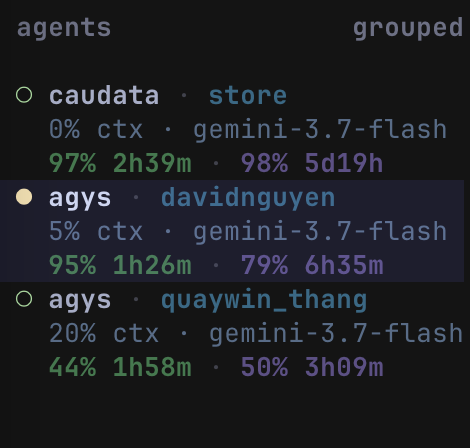
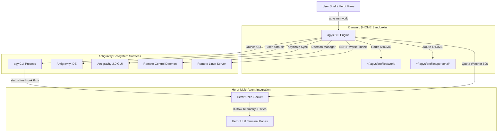

# Antigravity Ecosystem Switcher (`agys`)

[](https://go.dev/)
[](https://github.com/quaywin/agys)
[](LICENSE)
[](https://herdr.dev)

> **Zero-Collision Multi-Account Orchestration for Antigravity & Herdr — Powered by Dynamic `$HOME` Sandboxing.**

`agys` (Antigravity Switcher) is a pure Go CLI utility that isolates and orchestrates multi-account profiles across the entire Google Antigravity ecosystem — supporting **Herdr Multi-Agent Workspaces**, **Antigravity CLI (`agy`)**, **Antigravity IDE**, **Antigravity 2.0 Desktop App (GUI)**, and **Antigravity Remote Control**.

> [!NOTE]
> Each profile is strictly sandboxed under `~/.agys/profiles/<profile_name>/`. Dynamic `$HOME` routing guarantees zero auth token bleed, separate configs, isolated quota tracking, and conflict-free multi-pane agent swarms.

---

## ⚡ Herdr Multi-Agent Workspace Spotlight

`agys` provides first-class, zero-dependency integration and an official [Herdr Plugin](https://herdr.dev/docs/plugins/) designed for power developers running parallel agent swarms.

<p align="center">
  
</p>

```text
┌─────────────────────────────────────────────────────────────┐
│ ● agys · davidnguyen                                        │ ◄── Workspace & Active Profile
│   5% ctx · gemini-3.8-flash                                 │ ◄── Context Window % & Active Model
│   95% 1h26m · 79% 6h35m                                     │ ◄── High-Contrast 5H & Weekly Quotas
└─────────────────────────────────────────────────────────────┘
```

### 🎯 Why Herdr Users Love `agys`
- 🛡️ **Per-Pane Sandboxing**: Run 10+ Herdr panes with different Google accounts simultaneously without session collision or auth token bleed.
- 🎨 **3-Row High-Contrast Sidebar**: Real-time project name, active profile (cyan bold), live context window % + full model ID (light blue), and dual 5H & Weekly quotas (green/purple).
- ⚡ **Hybrid Telemetry (0ms + 60s Watcher)**:
  - **Turn-by-Turn Push (0ms)**: Captures context window usage and model switches instantly via Antigravity `statusLine` hook streaming.
  - **Passive Polling Watcher (60s)**: Background single-leader file-locked goroutine auto-updates reset countdowns and auto-recovers quotas upon 5h reset.
- 🏷️ **Rich Window & Tab Titles**: Shows live model abbreviation, context %, and dual reset countdown timers:
  `agys: <profile> [<model_abbr>] Ctx: <pct>% • 5H: <pct>% (<eta>) • Wk: <pct>% (<eta>)`
- 🚀 **100% Pure Go**: Native binary execution — zero Python, pip, shims, or wrapper overhead.

### 🔌 Quick Herdr Setup

Install the Herdr Plugin (the 3-row sidebar layout and telemetry are configured **100% automatically**):

```bash
# Install Herdr Plugin from Marketplace (or link locally)
herdr plugin install quaywin/agys
# or: herdr plugin link /path/to/agys
```

> [!TIP]
> **Zero Manual Configuration**: Even without installing the plugin, simply launching `agys run <profile>` in any Herdr pane will automatically detect the environment and configure the 3-row sidebar layout on the fly!

---

## 🌐 Supported Antigravity Surfaces

| Surface | Command | Mechanism | Highlights |
| :--- | :--- | :--- | :--- |
| **Herdr Multi-Agent** | `agys run <profile>` | Socket RPC & Lifecycle Hooks | 3-row sidebar telemetry, rich title countdowns, 0ms context tracking, per-pane isolation |
| **Antigravity CLI (`agy`)** | `agys run <profile>` | `$HOME` Override | Isolated terminal sessions, real-time 5h/weekly quota tracking, auto-failover, session resume |
| **Antigravity IDE** | `agys ide <profile>` | `--user-data-dir` | Parallel multi-window IDE sessions, independent logged-in accounts, smart auto-selection |
| **Antigravity 2.0 GUI** | `agys gui <profile>` | macOS Keychain Sync | macOS Keychain OAuth sync, process cleanup, confirmation prompts, auto-seeding |
| **Antigravity Remote** | `agys remote <profile>` | Detached Daemon / Cloud Relay | Headless daemon, auto-port collision resolution, web UI & Cloud portal (`antigravity.google`) |
| **Remote Server (SSH)** | `agys ssh <host>` | SSH API Reverse Tunnel | 0.1s token sync, remote agent auto-bootstrap, datacenter IP geo-block bypass |

---

## ✨ Features

- **Dynamic `$HOME` Sandboxing**: Complete environment isolation per profile (`~/.agys/profiles/<profile>/`) with automatic Keychain token protection.
- **Real-Time 5H & Weekly Quota HUD**: Parallel model quota tracking across all configured accounts powered by the `daily-cloudcode-pa` endpoint.
- **Smart Auto Profile Selection**: Automatically routes commands to the profile with the best 5-hour Gemini quota, respecting custom priority weights (`agys priority set`).
- **Session History & Resume (`agys resume`)**: Search, inspect, and resume past conversation sessions by project or profile with interactive selection and preserved CLI flags.
- **Cross-Platform Native (macOS & Linux)**: 100% pure Go static binary with zero CGO dependencies; safe token file sandboxing on Linux and seamless Keychain synchronization on macOS.
- **Robust Path & Environment Preservation**: Bulletproof `$HOME` and `$PATH` routing (`~/.local/bin`, `~/go/bin`, Homebrew) guaranteeing child hooks and tools run without `command not found` or config shadowing.
- **Herdr Multi-Agent Integration**: Native 3-row sidebar telemetry, rich terminal tab titles, and live reset countdowns.
- **Fast Plugin Management (`agys plugin`)**: Install, list, and uninstall plugins across single or all profiles (`--all`) without session overhead.
- **Parallel Antigravity IDE (`agys ide`)**: Launch multiple independent IDE windows simultaneously logged into different Google accounts.
- **Desktop App GUI Switcher (`agys gui`)**: Seamless macOS Keychain OAuth synchronization and profile switching for the Antigravity 2.0 GUI.
- **Remote SSH Execution (`agys ssh`)**: Run `agy` on any remote Linux server with instant 0.1s credential sync and reverse-tunneled API calls to bypass datacenter geo-blocking.
- **Headless Remote Control Daemon (`agys remote`)**: Background daemon management with dynamic port allocation and Google Cloud Relay access.
- **AI-Powered Staged Commit (`agys commit`)**: Reviews staged git changes using the best-quota profile and generates conventional commit messages.
- **Backup & Migration**: Instant profile cloning (`agys clone`), bulk export/import (`agys export` / `agys import`) with path-traversal safety checks.
- **Shell Completions & Aliases**: Built-in tab-completion for `zsh`, `bash`, `fish`, `powershell` and alias generation (`agys alias`).
- **In-Place Atomic Upgrades**: Safe self-upgrades with ad-hoc code signing (`agys upgrade`).

---

## Installation

### One-Liner Shell Installer

Install the latest release automatically:

```bash
curl -fsSL https://raw.githubusercontent.com/quaywin/agys/main/install.sh | bash
```

The script detects your OS and CPU architecture, fetches the latest GitHub release, and installs `agys` to `$HOME/.local/bin` or `/usr/local/bin`.

### From Source

If you have Go 1.22+ installed:

```bash
git clone https://github.com/quaywin/agys.git
cd agys
go build -o agys main.go
mv agys ~/.local/bin/
```

---

## 🚀 Quick Start & Core Workflows

### 1. Add & Authenticate a Profile
Create a new isolated sandbox and log in via `agy login`:

```bash
agys add work
agys add personal
```

### 2. List Profiles & View Google Accounts
Display all configured profiles with their Google Account emails and priority weights:

```bash
agys list
# Active Profiles:
#   - personal (user.personal@gmail.com) [prio: 0] (/Users/user/.agys/profiles/personal)
#   - work (user.work@company.com) (default) [prio: 10] (/Users/user/.agys/profiles/work)

# Or show a compact quota summary directly in list view:
agys list -q
# or: agys ls --quota
```

### 3. Check Quota HUD (`agys quota`)
Display remaining 5-hour and weekly model quotas with reset countdown timers across all accounts in parallel:

```bash
# Check detailed quota for all profiles in parallel
agys quota
# or shorthand:
agys q

# Check quota for a specific profile
agys quota work

# Output structured JSON for scripts or automation
agys quota --json
```

### 4. Set Default Profile & Auto Selection
Set a default active profile or enable intelligent quota-based auto selection:

```bash
# Set a fixed default profile
agys use work

# Enable auto mode (dynamically picks profile with best 5h Gemini quota)
agys use auto

# View current default setting
agys use

# Clear default profile
agys use --unset

# Configure custom profile priorities (higher number = higher priority)
agys priority set work 10
agys priority set personal 5
agys priority list
```

> **How Auto Selection Works**: `agys` evaluates profiles starting from the highest priority. If a high-priority profile has **>= 50% 5h quota**, it is selected. If its quota drops below 50%, `agys` falls back to a lower-priority profile that has >= 50% quota. If all profiles are below 50%, `agys` selects the profile with the highest remaining 5h quota overall.

### 5. Run Commands Under a Profile
Execute any `agy` command isolated to a specific profile, your default profile, or sequentially across all profiles:

```bash
# Run command with an explicit profile
agys run work -- status

# Run command using default profile (or auto mode if set via `agys use auto`)
agys run -- status

# Execute using auto profile directly
agys auto -- status

# Execute sequentially across ALL active profiles
agys run --all -- status
# or using shorthand (-a):
agys run -a -- status
```

> **Smart Model & Effort Defaults**: `agys run` automatically defaults to `--model gemini-3.8-flash --effort high` if no model or reasoning effort is explicitly passed in your arguments. You can override at any time with `-m / --model` or `--effort` (supports `--model latest` or `--model auto` to automatically resolve to the highest model).

### 6. Search & Resume Conversation Sessions (`agys resume`)
List and resume previous conversation sessions by project and profile with preserved CLI flags and interactive TTY selection:

```bash
# List recent sessions for current project and prompt to choose interactively
agys resume

# Resume a specific session directly by index number
agys resume 1

# List sessions across ALL projects and profiles
agys resume --all
# or shorthand:
agys resume -a

# Filter sessions by project name or profile
agys resume --project my-project
agys resume --profile work

# Output sessions as JSON
agys resume --json
```

---

## 🖥️ Ecosystem Surfaces & Integrations

### 7. Standalone Antigravity IDE (`agys ide`)
Launch the standalone Antigravity IDE isolated to any profile with dedicated `--user-data-dir` storage. Run **multiple IDE windows in parallel** logged into different Google accounts simultaneously:

```bash
# Launch Antigravity IDE using default or auto profile
agys ide

# Launch Antigravity IDE for a specific profile
agys ide work

# Open a specific project directory in Antigravity IDE
agys ide work /path/to/my-project

# Auto-select profile with best quota and launch IDE
agys ide auto /path/to/my-project
```

> **Cross-Platform Support**: On macOS, `agys ide` launches `/Applications/Antigravity IDE.app`. On Linux, it automatically detects `antigravity`, `antigravity-ide`, or `code` binaries from `$PATH` and launches with profile `--user-data-dir`.

> **First-Time Setup**: When launching `agys ide <profile>` for the first time, log in once via the IDE prompt. The IDE permanently saves that profile's session in `~/.agys/profiles/<profile>/ide-data/`, enabling instant multi-window launches.

### 8. Antigravity Desktop App GUI (`agys gui`)
Launch the Antigravity 2.0 Desktop App GUI with isolated profile settings and automatic macOS Keychain OAuth token synchronization:

```bash
# Launch GUI for default or auto profile
agys gui

# Launch GUI for a specific profile
agys gui work

# Force restart GUI without interactive confirmation prompt
agys gui work --force
```

### 9. Headless Remote Control Daemon (`agys remote`)
Launch and manage background Antigravity Remote Control daemons across profiles without occupying your terminal. Supports auto-port collision resolution, credential sync, and web/cloud portal access (`antigravity.google`):

```bash
# Start background Remote Control daemon for default or auto profile
agys remote

# Start daemon for a specific profile on custom port
agys remote start work --port 4400 --name "my-macbook"

# View all active daemons, ports, URLs, and uptime
agys remote status
# or: agys remote ls

# Follow daemon output logs
agys remote logs work -f

# Restart or stop daemons
agys remote restart work
agys remote stop work
agys remote stop --all
```

### 10. Remote SSH Execution & Geo-Bypass (`agys ssh`)
Run `agy` natively on any remote Linux server over SSH using local profile credentials:

```bash
# Connect to remote server using default or auto profile
agys ssh user@remote-server

# Connect to a remote project folder using a specific profile
agys ssh user@remote-server /var/www/myproject work

# Pass extra agy flags directly
agys ssh user@remote-server /var/www/myproject work -- --dangerously-skip-permissions
```

* **Instant Credential Sync**: Syncs local OAuth tokens in 0.1s without remote login.
* **Geo-Block Bypass**: Tunnels Gemini API calls through an SSH reverse tunnel (`-R <port>`) back to your local machine, allowing full access from datacenter IPs.
* **Zero Orphan Processes**: Direct process replacement (`exec`) cleanly terminates remote processes upon SSH disconnect.

### 11. AI-Powered Staged Git Commit (`agys commit`)
Inspect staged git changes with AI (auto-selecting the best-quota profile), perform code review checks, and commit with an AI-generated conventional commit message:

```bash
# Auto-select best profile, review staged code, generate commit message, and prompt for confirmation
agys commit

# Use a specific profile to check staged code and commit
agys commit work

# Automatically stage all modified tracked files (-a) and commit with auto-confirmation (-y)
agys commit -a -y

# Provide custom message while running AI code review check
agys commit -m "feat(auth): support multi-account token refresh"

# Dry run mode (generates commit message without executing git commit)
agys commit --dry-run
```

---

## ⚙️ Profile & Ecosystem Management

### 12. Fast Plugin Management (`agys plugin`)
Install, list, or uninstall `agy` plugins directly with optional `--all` (`-a`) support across all profiles without session overhead:

```bash
# Install plugin for a specific profile (or current default profile)
agys plugin install https://github.com/obra/superpowers work

# Install plugin for ALL active profiles simultaneously
agys plugin install https://github.com/obra/superpowers --all
# or shorthand (-a):
agys plugin install https://github.com/obra/superpowers -a

# List installed plugins across ALL active profiles
agys plugin list --all

# Uninstall plugin from ALL active profiles
agys plugin uninstall superpowers --all
```

### 13. Profile Utilities: Clone, Export, Import, Rename, Delete

```bash
# Duplicate an existing profile (credentials and config)
agys clone work work-copy
# or alias: agys cp work work-copy

# Export profile(s) to a compressed archive
agys export work -o work_profile.tar.gz
agys export --all -o all_profiles.tar.gz

# Import profile(s) from an archive
agys import work_profile.tar.gz
agys import all_profiles.tar.gz --all --force

# Rename a profile directory
agys rename work company
# or alias: agys mv work company

# Delete a profile directory
agys delete work --force
# or alias: agys rm work --force
```

### 14. Shell Aliases & Auto-Completions

```bash
# Generate shell aliases for configured profiles (e.g. alias agy-work="agys run work --")
eval "$(agys alias)"

# Enable tab-completions in Zsh / Bash / Fish
source <(agys completion zsh)
source <(agys completion bash)
```

### 15. Self-Upgrade (`agys upgrade`)

```bash
# Upgrade agys CLI to latest release automatically
agys upgrade
# or alias: agys update

# Check if an update is available without installing
agys upgrade --check
```

### 16. AI Model Discovery & Auto-Detection (`agys models`)

`agys` automatically discovers and selects the highest version in the Gemini Flash model series from `agy` without requiring code updates when Google releases new versions:

```bash
# Display detected highest Flash & Pro models and cached models
agys models

# Force an immediate refresh from agy CLI
agys models --refresh # or -r
```

---

## 📁 Directory & Configuration Layout

`agys` stores all data under `~/.agys/` by default (configurable via the `AGYS_DIR` environment variable):

```text
~/.agys/
├── current                  # Active default profile setting (created by `agys use`)
├── priorities.json          # Configured profile priorities (created by `agys priority set`)
└── profiles/                # Base directory storing isolated sandboxes
    ├── work/                # Isolated HOME directory for profile "work"
    │   ├── .gemini/         # Antigravity CLI credentials, config, transcript
    │   └── ide-data/        # Antigravity IDE isolated user-data-dir
    └── personal/            # Isolated HOME directory for profile "personal"
```

---

## 📖 Complete CLI Reference

```text
agys isolates multi-account profiles across the Google Antigravity ecosystem (CLI, IDE, GUI, Remote)
and provides native, real-time profile quota tracking (5H & Weekly) and lifecycle hooks for Herdr multi-agent workspaces.

Usage:
  agys [command]

Available Commands:
  add              Create a new profile and perform agy login
  alias            Generate shell aliases for configured profiles
  auto             Execute agy command automatically using profile with the best 5h Gemini quota
  clone            Clone an existing profile to a new profile (alias: cp)
  commit           Check staged git files with AI and commit using auto-selected or specified profile
  completion       Generate shell completion scripts (bash, zsh, fish, powershell)
  delete           Delete a profile directory (alias: rm)
  export           Export a profile to a gzipped tar archive
  gui              Launch Antigravity 2.0 Desktop App GUI with isolated profile settings
  herdr            Manage Herdr multi-agent workspace integration (configure, status, uninstall)
  herdr-hook       Handle Herdr multi-agent lifecycle integration hooks (Internal / Automatic)
  ide              Launch standalone Antigravity IDE isolated to a profile
  import           Import a profile from a gzipped tar archive
  list             List all active profile directories (alias: ls)
  plugin           Manage plugins across isolated profiles (install, list, uninstall)
  priority         Manage profile priorities for auto profile selection (alias: prio, p)
  quota            Check model quota and usage for profile(s) (alias: q)
  remote           Manage background Antigravity Remote Control daemons (start, stop, logs, status)
  rename           Rename an existing profile directory (alias: mv)
  resume           List and resume previous conversation sessions by project and profile (alias: r)
  run              Execute agy command with specified profile, auto quota selection, or default profile
  ssh              Execute agys/agy natively on a remote server over SSH
  statusline-hook  Handle Antigravity statusLine context window hook (Internal / Automatic)
  upgrade          Upgrade agys CLI to the latest version (alias: update)
  use              Set or display the default active profile
  version          Display version information for agys CLI

Flags:
  -h, --help      help for agys
  -v, --version   version for agys
```

---

## 🏗️ Architecture


```mermaid
graph TD
    UserShell["User Shell / Herdr Pane"] -->|agys run work| AGYS["agys CLI Engine"]

    subgraph Sandboxing ["Dynamic $HOME Sandboxing"]
        AGYS -->|Route $HOME| ProfWork["~/.agys/profiles/work/"]
        AGYS -->|Route $HOME| ProfPersonal["~/.agys/profiles/personal/"]
    end

    subgraph Ecosystem ["Antigravity Ecosystem Surfaces"]
        AGYS -->|Launch CLI| AGYCLI["agy CLI Process"]
        AGYS -->|--user-data-dir| AGYIDE["Antigravity IDE"]
        AGYS -->|Keychain Sync| AGYGUI["Antigravity 2.0 GUI"]
        AGYS -->|Daemon Manager| AGYRemote["Remote Control Daemon"]
        AGYS -->|SSH Reverse Tunnel| RemoteHost["Remote Linux Server"]
    end

    subgraph HerdrIntegration ["Herdr Multi-Agent Integration"]
        AGYCLI -->|statusLine Hook 0ms| HerdrSocket["Herdr UNIX Socket"]
        AGYS -->|Quota Watcher 60s| HerdrSocket
        HerdrSocket -->|3-Row Telemetry & Titles| HerdrSidebar["Herdr UI & Terminal Panes"]
    end
```

---

## 📄 License

This project is licensed under the MIT License — see the [LICENSE](LICENSE) file for details.
